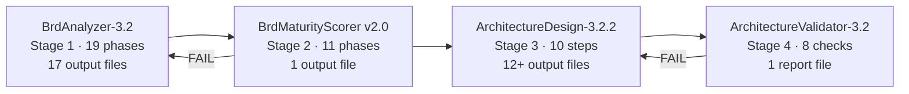

# Full Pipeline Analysis Report

> [!IMPORTANT]
> This report covers the **entire 4-stage pipeline** — all 4 agents, all 18 skills, file flow compatibility, structural gaps, and actionable recommendations. Findings are ordered by impact.

## Pipeline Overview



| Agent | Version | Lines | Skills Used | Inputs | Outputs |
|---|---|---|---|---|---|
| BrdAnalyzer | 3.2 | 1,064 | 10 | Raw BRD (.md) + UI mockups | 17 JSON files in `/analysis/` |
| BrdMaturityScorer | 2.0 | 510 | 0 | 17 `/analysis/` files | `maturity-score.json` |
| ArchitectureDesign | 3.2.2 | 739 | 6 | 17 `/analysis/` files + `maturity-score.json` | 12+ files in `/architecture/` |
| ArchitectureValidator | 3.2 | 333 | 2 | 12+ `/architecture/` + `/analysis/` files | `validation_report.json` + markdown |

---

## 🔴 CRITICAL — Skills Out of Sync with Agents

The agents were updated (BrdAnalyzer-3.2, ArchitectureDesign-3.2.2, ArchitectureValidator-3.2) but **most skills still reference old structures**. This is the single biggest issue — skills are loaded at runtime and will actively mislead the agents.

### 1. [architecture-context/SKILL.md](file:///e:/AI-Automation-Workflow/Automation-Stuff/skills/architecture-context/SKILL.md) — Checkpoint Schema Outdated

**Problem**: The checkpoint schema (lines 90-114) references a **4-step structure**:
```
step_1_brd_parser, step_2_domain_model, step_3_hld, step_4_lld
```
But ArchitectureDesign-3.2.2 now has **10 steps**: BRD Parser → Tech Consultation → Domain Model → FDD → HLD → LLD → SDD → TDD → Decision Log → Self-Validation.

**Impact**: Checkpoint resume will fail — agent will skip to Step 4 (which no longer exists as a single step), or mark wrong steps as completed.

**Fix Required**: Update checkpoint schema to 10-step structure:
```
step_1_brd_parser, step_2_tech_consultation, step_3_domain_model,
step_4_fdd, step_5_hld, step_6_lld, step_7_sdd, step_8_tdd,
step_9_decision_log, step_10_self_validation
```

Also update Rule 8 skill loading table (line 229-236) from 5-row to 10-row.

---

### 2. [architecture-validator/SKILL.md](file:///e:/AI-Automation-Workflow/Automation-Stuff/skills/architecture-validator/SKILL.md) — Only 5 Checks

**Problem**: Skill defines Checks 1-5 (flow completeness, API consistency, schema completeness, assumption detection, traceability). But the ArchitectureValidator-3.2 agent runs **8 checks** (added: technology consistency, TDD coverage, SDD-flow alignment).

**Impact**: The skill will instruct the agent on HOW to run the old 5 checks but provides zero guidance for the 3 new checks. The agent file says "follow architecture-validator skill" but the skill doesn't know about Checks 6-8.

**Fix Required**: Add Check 6 (Technology Consistency), Check 7 (TDD Coverage), Check 8 (SDD-Flow Alignment) sections to the skill, including finding types, severity classifications, and auto-fix rules.

---

### 3. [brd-parser/SKILL.md](file:///e:/AI-Automation-Workflow/Automation-Stuff/skills/brd-parser/SKILL.md) — Doesn't Load New Outputs

**Problem**: The brd-parser skill (Step 2) loads context from 7 files:
- architecture_handoff.json ✅
- requirements_catalog.json ✅
- domain_model_seed.json ✅
- business_rules.json ✅
- glossary.json ✅
- assumptions_and_risks.json ✅
- clarification_questions.json ✅

But it does **NOT** load:
- ❌ `user_journeys.json` — needed for FDD (Step 4)
- ❌ `api_surface_hints.json` — needed for LLD (Step 6)
- ❌ `data_flow_map.json` — needed for SDD (Step 7)
- ❌ `feature_groups.json` — needed for FDD (Step 4)
- ❌ `maturity-score.json` — needed for quality gate
- ❌ `technology_consultation.json` — needed for smart tech consultation (Step 2)
- ❌ `technology_constraints_binding.json` — needed for tech consultation

**Impact**: Agent won't have these files in context unless it ignores the skill and reads them directly (which violates the skill's "only place where files are read" rule).

**Fix Required**: Add sections 2h through 2n for the 7 missing files.

---

### 4. [output-architect/SKILL.md](file:///e:/AI-Automation-Workflow/Automation-Stuff/skills/output-architect/SKILL.md) — TDD Definition Conflict

**Problem**: The output-architect skill defines TDD as a **"Technical Design Document — Master"** that combines HLD + LLD into one document. But ArchitectureDesign-3.2.2 defines TDD as a **"Test Design Document"** with test cases derived from requirements, business rules, and API contracts.

**Impact**: Two conflicting definitions of TDD in the same pipeline. If the agent loads this skill, it will assemble HLD+LLD instead of generating test cases.

**Fix Required**: Rename the output-architect's TDD to "Master Technical Document (MTD)" or remove it, and ensure the architecture agent's Step 8 TDD (Test Design Document) is the authoritative definition. Update the skill to not produce a "TDD.md".

---

### 5. [output-factory/SKILL.md](file:///e:/AI-Automation-Workflow/Automation-Stuff/skills/output-factory/SKILL.md) — Only 7 Output Schemas

**Problem**: Defines schemas for 7 files:
1. intake-manifest.json ✅
2. requirements_catalog.json ✅  
3. clarification_questions.json ✅
4. assumptions_and_risks.json ✅
5. traceability_matrix.json ✅
6. glossary.json ✅
7. analysis_summary.json ✅ (partial — refers to main agent)

But BrdAnalyzer-3.2 now produces **17 output files** (10 more):
- ❌ domain_model_seed.json
- ❌ business_rules.json
- ❌ technology_consultation.json
- ❌ technology_constraints_binding.json
- ❌ architecture_handoff.json
- ❌ pending_clarifications.json
- ❌ user_journeys.json
- ❌ api_surface_hints.json
- ❌ data_flow_map.json
- ❌ feature_groups.json

**Impact**: No schema enforcement for 10 output files. The maturity scorer and architecture agent expect specific field names but the output-factory doesn't validate them.

**Fix Required**: Add schemas for all 10 missing output files.

---

### 6. [context-management/SKILL.md](file:///e:/AI-Automation-Workflow/Automation-Stuff/skills/context-management/SKILL.md) — Phase List Outdated

**Problem**: The phase completion section (lines 126-141) only lists Phases 0-13. But BrdAnalyzer-3.2 now has **19 phases** (Phases 0-18).

**Impact**: Checkpoint won't track Phases 14-18. Resume from checkpoint will skip phases that should run.

**Fix Required**: Update `phase_completion` to include all 19 phases.

Also, the `output_files` section (lines 161-169) only lists 7 files — needs all 17.

---

### 7. [hld-generator/SKILL.md](file:///e:/AI-Automation-Workflow/Automation-Stuff/skills/hld-generator/SKILL.md) — References "Step 3"

**Problem**: Description says "Load this skill at Step 3 of the Architecture Design Agent." In the new structure, HLD generation is **Step 5**.

**Impact**: Minor — agent follows the agent file's step mapping, not the skill's description. But maintenance confusion.

**Fix Required**: Update description to "Step 5".

---

### 8. [lld-generator/SKILL.md](file:///e:/AI-Automation-Workflow/Automation-Stuff/skills/lld-generator/SKILL.md) — References "Step 4"

**Problem**: Description says "Load this skill at Step 4." In the new structure, LLD is **Step 6**.

**Fix Required**: Update description to "Step 6".

---

### 9. [domain-modeler/SKILL.md](file:///e:/AI-Automation-Workflow/Automation-Stuff/skills/domain-modeler/SKILL.md) — References "Step 2"

**Problem**: Description says "Load this skill at Step 2." In the new structure, Domain Modeling is **Step 3**.

**Fix Required**: Update description to "Step 3".

---

### 10. [output-architect/SKILL.md](file:///e:/AI-Automation-Workflow/Automation-Stuff/skills/output-architect/SKILL.md) — References "Step 4"

**Problem**: Description says "Load this skill at the end of Architecture Design Agent Step 4." New structure is **Step 9**.

**Fix Required**: Update description to "Step 9".

---

## 🟡 HIGH — Structural Pipeline Gaps

### 11. No Maturity Scorer Skill

BrdMaturityScorer uses **zero skills**. The scoring algorithms (completeness calculation, clarity scoring, risk point computation) are entirely inline in the 510-line agent. This means:
- Scoring logic can't be reused by other agents (e.g., a future Design Maturity Scorer)
- Testing scoring logic requires running the full agent
- No single source of truth for weight constants

**Recommendation**: Extract a `maturity-scoring/SKILL.md` containing:
- Weight tables and sub-dimension formulas
- Safety cap definitions
- Score normalization patterns
- Cross-validation logic

---

### 12. `multi-format-intake` References "Unified Content Buffer"

The skill repeatedly references a "unified content buffer" (lines 14, 111, 129, 145). But the `context-management` skill explicitly says **"The agent MUST NOT follow the unified content buffer pattern"** (line 31).

**Impact**: Direct contradiction between two skills. If both are loaded, the agent gets conflicting instructions.

**Fix Required**: Update `multi-format-intake` to reference "section-by-section streaming" instead of "unified content buffer". Replace all buffer references with "write to disk immediately after extraction."

---

### 13. `output-factory` requirements_catalog.json Schema Mismatch

The requirements_catalog.json schema in `output-factory` (lines 59-132) is missing several fields that BrdAnalyzer-3.2 now produces:
- ❌ `data_entities_involved`
- ❌ `implied_api_operations`
- ❌ `ui_screens_referenced`
- ❌ `feature_group`
- ❌ `test_strategy_hint`
- ❌ `nfr_quantified_target`
- ❌ `clarification_needed`
- ❌ `clarification_reason`

These fields exist in the agent but not in the validation schema. The output-factory won't validate them.

**Fix Required**: Add all missing fields to the requirements_catalog schema in output-factory.

---

### 14. No Pipeline Orchestrator Agent

Currently, handoffs between stages are manual. The user must:
1. Run BrdAnalyzer → manually trigger BrdMaturityScorer
2. BrdMaturityScorer says PASS → manually trigger ArchitectureDesign
3. ArchitectureDesign completes → manually trigger ArchitectureValidator
4. ArchitectureValidator says FAIL → manually re-trigger ArchitectureDesign

**Recommendation**: Create a **Pipeline Orchestrator** agent (or workflow) that:
- Automatically sequences stages
- Handles pass/fail routing
- Tracks overall pipeline state
- Reports progress to user at key milestones

---

### 15. No Error Recovery Between Stages

If BrdAnalyzer produces partial output (e.g., crashes at Phase 12 out of 19), the downstream agents have no way to detect this. The maturity scorer will attempt to score incomplete data and may give misleading results.

**Recommendation**: Add a `pipeline_status.json` file that each stage writes with its completion status, output file manifest, and any errors. The next stage reads this before starting.

---

## 🟠 MEDIUM — Efficiency Improvements

### 16. Skill Count Disparity

| Agent | Skills | Concern |
|---|---|---|
| BrdAnalyzer | 10 | Appropriate — many phases |
| BrdMaturityScorer | 0 | Should have 1 (maturity-scoring) |
| ArchitectureDesign | 6 | Appropriate |
| ArchitectureValidator | 2 | Should have 2 + updates to existing skills |

---

### 17. `greenfield-intelligence` Outputs Not Consumed Downstream

This skill writes `greenfield_guidance.json` to `/analysis/`, but:
- BrdMaturityScorer doesn't check it (could add a "technology readiness" scoring dimension)
- ArchitectureDesign doesn't read it (could use scalability patterns for HLD decisions)

**Recommendation**: Add `greenfield_guidance.json` consumption to both downstream agents.

---

### 18. No Version Compatibility Matrix

When skills and agents are updated independently, there's no way to detect incompatibilities at load time. Example: ArchitectureDesign-3.2.2 expects `architecture-context` to have a 10-step checkpoint, but the skill still has 4 steps.

**Recommendation**: Add a `compatibility_matrix.json` at the pipeline level:
```json
{
  "BrdAnalyzer-3.2": {"skills": {"context-management": ">=2.0", "output-factory": ">=2.0"}},
  "ArchitectureDesign-3.2.2": {"skills": {"architecture-context": ">=2.0", "brd-parser": ">=2.0"}}
}
```

---

## Summary: Priority-Ordered Action Items

### 🔴 Critical (Pipeline Breaks)
| # | Item | Files to Update |
|---|---|---|
| 1 | Update `architecture-context` checkpoint to 10-step structure | [skills/architecture-context/SKILL.md](file:///e:/AI-Automation-Workflow/Automation-Stuff/skills/architecture-context/SKILL.md) |
| 2 | Add 3 new checks to `architecture-validator` skill | [skills/architecture-validator/SKILL.md](file:///e:/AI-Automation-Workflow/Automation-Stuff/skills/architecture-validator/SKILL.md) |
| 3 | Add 7 missing file loads to `brd-parser` skill | [skills/brd-parser/SKILL.md](file:///e:/AI-Automation-Workflow/Automation-Stuff/skills/brd-parser/SKILL.md) |
| 4 | Resolve TDD naming conflict in `output-architect` | [skills/output-architect/SKILL.md](file:///e:/AI-Automation-Workflow/Automation-Stuff/skills/output-architect/SKILL.md) |
| 5 | Add 10 missing output schemas to `output-factory` | [skills/output-factory/SKILL.md](file:///e:/AI-Automation-Workflow/Automation-Stuff/skills/output-factory/SKILL.md) |
| 6 | Update `context-management` phase list to 19 phases | [skills/context-management/SKILL.md](file:///e:/AI-Automation-Workflow/Automation-Stuff/skills/context-management/SKILL.md) |

### 🟡 High (Structural Gaps)
| # | Item | Files to Create/Update |
|---|---|---|
| 7 | Fix `multi-format-intake` "unified content buffer" contradiction | [skills/multi-format-intake/SKILL.md](file:///e:/AI-Automation-Workflow/Automation-Stuff/skills/multi-format-intake/SKILL.md) |
| 8 | Add missing fields to `output-factory` requirements_catalog schema | [skills/output-factory/SKILL.md](file:///e:/AI-Automation-Workflow/Automation-Stuff/skills/output-factory/SKILL.md) |
| 9 | Create `maturity-scoring` skill | `skills/maturity-scoring/SKILL.md` [NEW] |
| 10 | Update step references in 4 skills (domain-modeler, hld-generator, lld-generator, output-architect) | 4 skill files |

### 🟠 Medium (Process Improvements)
| # | Item | Files to Create |
|---|---|---|
| 11 | Add `greenfield_guidance.json` consumption to downstream agents | Agent files |
| 12 | Create pipeline orchestrator workflow | `workflows/pipeline-orchestration.md` [NEW] |
| 13 | Add error recovery via `pipeline_status.json` | Agent files |
| 14 | Create version compatibility matrix | `compatibility_matrix.json` [NEW] |
